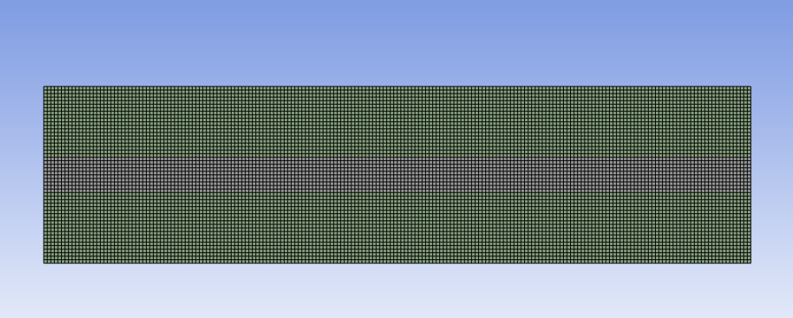
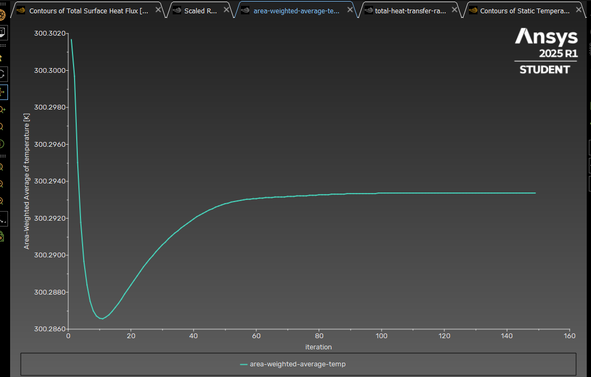
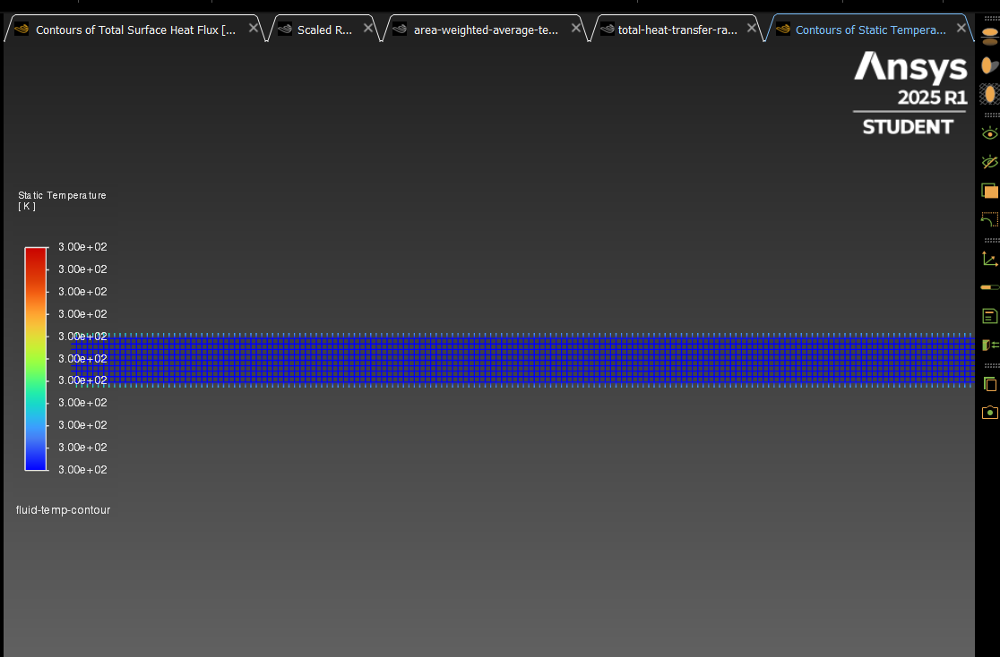
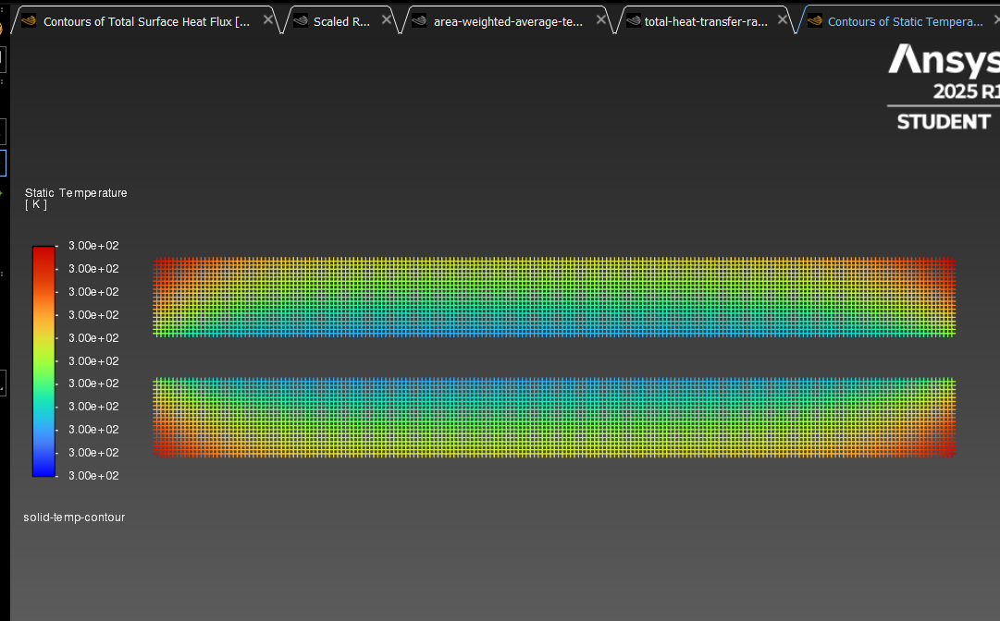
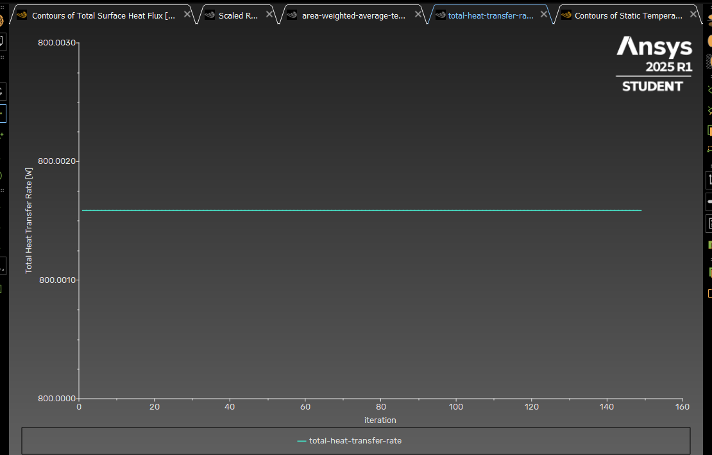
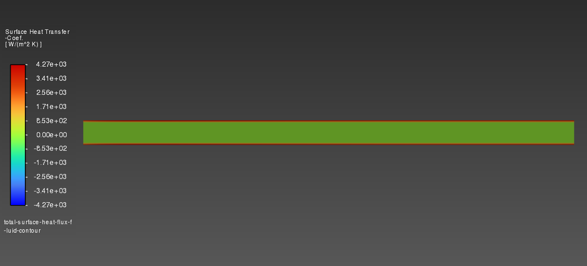
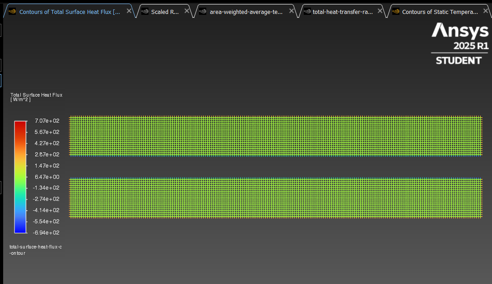
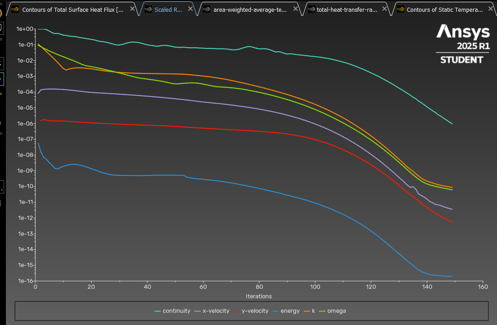

# Comparative-Cooling-Analysis-Wind-2-m-s-vs.-Water-Flow-1-m-s-
This CFD analysis investigates and compares the thermal performance of a panel cooled by **air flow at 2 m/s** (previous study) and **water flow at 1 m/s** (this current study). The focus is on evaluating the improvement in cooling when the same heat load is applied to the system but different cooling mediums are used.

---

## 🔍 Objective

To simulate and compare the temperature distribution and heat transfer characteristics of a panel subjected to forced convection using:

- **Air** at 2 m/s (from a previous simulation)
- **Water** at 1 m/s flowing through a pipe underneath the panel

Both cases aim to dissipate approximately **800 W of heat flux** from the surface.

---

## 🧪 Simulation Setup (This Project)

### ✔️ Domain Description

- **Fluid**: Water
- **Flow Speed**: 1 m/s
- **Pipe Diameter**: 0.05 m
- **Solid Surface**: Thermally conductive panel
- **Mesh Size**: 10,000 elements
- **Heat Flux Input**: ~800 W (actual value affected by solid thermal properties)

---

### ⚙️ Reynolds Number

The Reynolds number is calculated using the formula:

Re = (ρ × V × D) / μ

Assuming water properties at ~25°C:
- Density (ρ) ≈ 997 kg/m³  
- Velocity (V) = 1 m/s  
- Diameter (D) = 0.05 m  
- Dynamic viscosity (μ) ≈ 0.00089 Pa·s  

Re = (997 × 1 × 0.05) / 0.00089 ≈ 56,000

✅ **Flow Regime**: Turbulent

---

## 🧊 Results Summary

| Metric                         | Value (Approx.) | Notes                                 |
|-------------------------------|------------------|----------------------------------------|
| Average Panel Temperature     | See plot below   | Lower than air cooling case            |
| Total Heat Transfer Rate      | ~800 W           | Confirmed via Fluent output            |
| Solid Temperature Gradient    | See contour plot | Indicates efficient conduction         |
| Scaled Residuals              | See graph below  | Solution converged properly            |

---

## 🖼️ Result Visualizations

### 🔸 Mesh

### 🔸 Area-Weighted Average Temperature

### 🔸 Fluid Temperature Contour

### 🔸 Solid Temperature Contour

### 🔸 Total Heat Transfer Rate

### 🔸 Total Surface Heat Flux – Fluid Side

### 🔸 Total Surface Heat Flux – Solid Side

### 🔸 Scaled Residuals

---

## ⚖️ Comparison with Air Cooling (2 m/s)

| Criteria              | Air Cooling (2 m/s) | Water Cooling (1 m/s) |
|----------------------|---------------------|------------------------|
| Cooling Medium        | Air                 | Water                  |
| Flow Speed           | 2 m/s               | 1 m/s                  |
| Reynolds Number      | ~6,800              | ~56,000                |
| Heat Transfer Rate   | ~800 W              | ~800 W                 |
| Surface Temperature  | Higher              | Lower                  |
| Effectiveness        | Moderate            | High                   |

💡 **Insight:** Even at half the velocity, water exhibits significantly better thermal performance due to its much higher thermal capacity and density compared to air.

---

## 📁 Files in This Repository

- CFD result images in PNG format
- This `README.md` file
- Simulation performed in ANSYS Fluent

---

## 🧠 Author’s Note

This project is a part of a comparative study to understand the efficiency of different cooling methods using CFD. All simulations were conducted using ANSYS Fluent with consistent mesh density and solver settings. For further technical insights or collaboration, feel free to reach out.

---

## 📬 Contact

If you have any questions, suggestions, or collaboration ideas related to this project or CFD in general, feel free to reach out!

📧 Email: **burakyorukcu@outlook.com**

I'm always open to discussing simulation techniques, improving model accuracy, or exploring new CFD topics.

